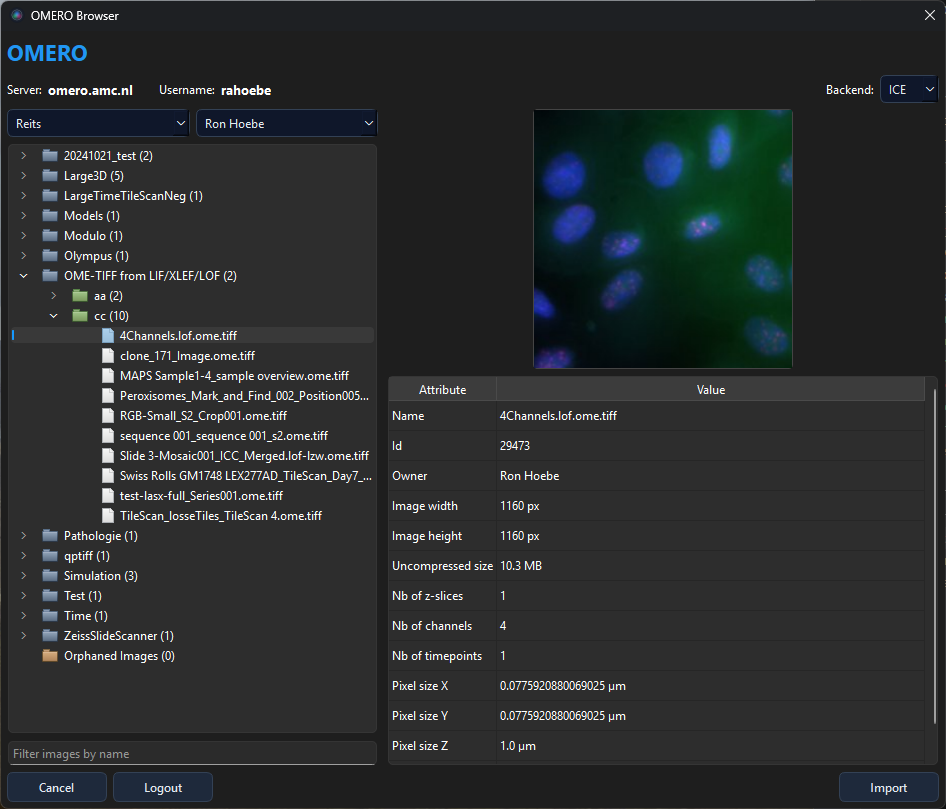

# omero-browser-qt

[](https://pypi.org/project/omero-browser-qt/)
[](https://pypi.org/project/omero-browser-qt/)
[](https://cellular-imaging-amsterdam-umc.github.io/omero-browser-qt/)
[](LICENSE)

Reusable PyQt6 dialog for browsing and retrieving images from [OMERO](https://www.openmicroscopy.org/omero/) servers.

<p align="center">
  
</p>

## Features

- **Login dialog** with server-name history (credentials never stored)
- **QuPath-style browser** — group/owner filters, lazy-loading tree, thumbnail preview, attribute table, name filter
- **ICE pixel loading** — full 5-D arrays or tile-based dask lazy loading for large / pyramidal images
- **OMERO viewer** — installable multi-channel viewer with optional 3D rendering
- **3D volume viewer** — GPU-accelerated rendering (MIP, Translucent, Isosurface, Additive) via vispy
- Embeddable in any PyQt6 application

## Prerequisites

`omero-py` requires **ZeroC ICE** (pre-built wheels for Python 3.10–3.12):

```bash
# Example for Python 3.11 on Windows — see docs for all platforms
pip install https://github.com/glencoesoftware/zeroc-ice-py-win-x86_64/releases/download/20240325/zeroc_ice-3.6.5-cp311-cp311-win_amd64.whl
pip install omero-py
```

Or via conda: `conda install -c conda-forge zeroc-ice omero-py`

See the [Getting Started guide](https://cellular-imaging-amsterdam-umc.github.io/omero-browser-qt/getting-started/) for all platforms.

## Installation

```bash
pip install omero-browser-qt
```

This installs the reusable browser/dialog package and the `omero_viewer`
launcher. On Windows, pip creates `omero_viewer.exe` in the environment's
`Scripts` directory.

For full 3D viewer support:

```bash
pip install "omero-browser-qt[viewer]"
```

## Quick start

```python
from PyQt6.QtWidgets import QApplication
from omero_browser_qt import OmeroGateway, OmeroBrowserDialog

app = QApplication([])
gw = OmeroGateway()

for img in OmeroBrowserDialog.select_images(gateway=gw):
    print(img.getName(), img.getId())

gw.disconnect()
```

For structured selection with project/dataset breadcrumbs:

```python
for ctx in OmeroBrowserDialog.select_image_contexts():
    print(ctx.breadcrumb, ctx.image.getId())
```

## OMERO Viewer

```bash
omero_viewer
```

<p align="center">
  
</p>

From a source checkout, you can also run:

```bash
python -m omero_browser_qt.omero_viewer
```

See the [OMERO Viewer guide](https://cellular-imaging-amsterdam-umc.github.io/omero-browser-qt/examples/omero-viewer.html) for controls and features.

## Documentation

Full documentation: **<https://cellular-imaging-amsterdam-umc.github.io/omero-browser-qt/>**

- [Getting Started](https://cellular-imaging-amsterdam-umc.github.io/omero-browser-qt/getting-started/) — prerequisites, install, first workflow
- [User Guide](https://cellular-imaging-amsterdam-umc.github.io/omero-browser-qt/user-guide/browser-dialog/) — browser, pixel loading, 3D viewer
- [API Reference](https://cellular-imaging-amsterdam-umc.github.io/omero-browser-qt/api/) — auto-generated from docstrings
- [Examples](https://cellular-imaging-amsterdam-umc.github.io/omero-browser-qt/examples/) — recipes and the OMERO Viewer

## License

MIT
