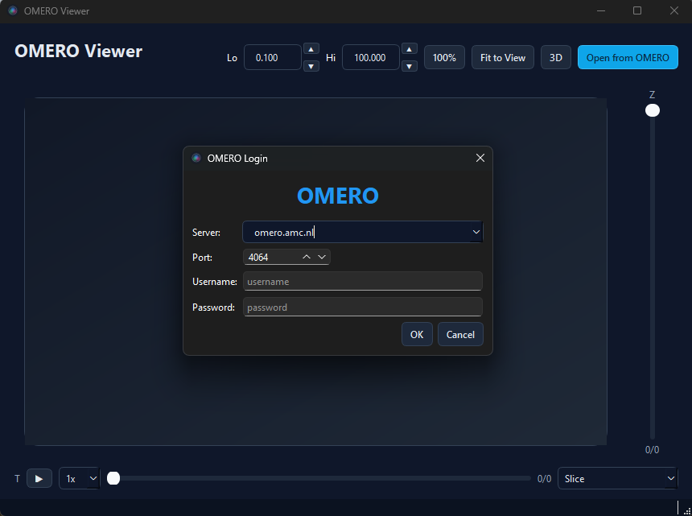
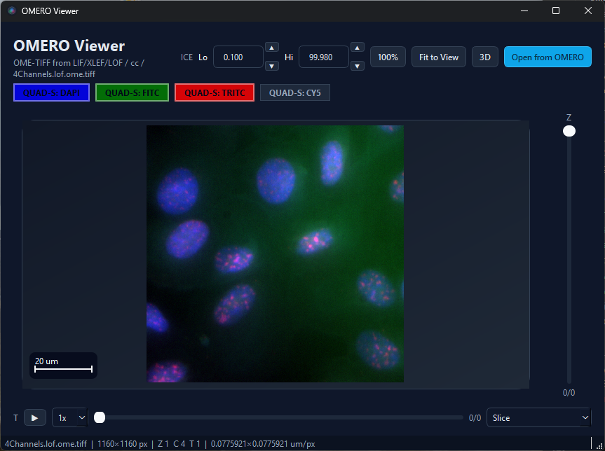

# OMERO Viewer

A full-featured multi-channel image viewer is included at
[`src/omero_browser_qt/omero_viewer.py`](https://github.com/Cellular-Imaging-Amsterdam-UMC/omero-browser-qt/blob/main/src/omero_browser_qt/omero_viewer.py).

<p align="center">
  
</p>

## Running

```bash
omero_viewer
```

From a source checkout, you can also run:

```bash
python -m omero_browser_qt.omero_viewer
```

For 3D volume rendering, install the optional extra first:

```bash
pip install "omero-browser-qt[viewer]"
```

## Features

<p align="center">
  
</p>

### 2D viewer

- **Open from OMERO** — launches the login + browser dialogs
- **Projection modes** — Slice, MIP, SUM, Mean, Median, Extended Focus, Local Contrast
- **Z slider** — navigate slices (enabled in Slice mode)
- **Timepoint slider** — navigate T dimension
- **Lo% / Hi%** — percentile-based contrast adjustment
- **Channel buttons** — toggle individual channels, coloured to match OMERO metadata
- **Scale bar** — automatic overlay when physical pixel size is available
- **Cursor readout** — live X / Y / Z / T in the status bar
- **Fit to View** — reset zoom and fit content to the window
- **Mouse** — scroll to zoom, drag to pan
- **Play/Pause** — animate through Z-slices or timepoints

### 3D viewer

- **Render modes** — MIP, Attenuated MIP, Translucent, Average, Isosurface, Additive, and MinIP when appropriate for the image type
- **Mode-aware slider** — gain, attenuation, threshold, or cutoff depending on the selected render mode
- **Downsample** — reduce voxel density for faster 3D interaction
- **Smooth** — toggle interpolation between linear and nearest sampling when supported by the current mode
- **Multi-channel** — additive blending with OMERO channel colours
- **Arcball rotation** — freely rotate the stack, including upside-down views
- **Progress bar** — shown while loading Z-stacks
- **Cached stacks** — contrast adjustments don't re-fetch data
- **RGB toggles** — plain RGB images are shown as `R`, `G`, and `B`

## Architecture

The viewer demonstrates:

- `OmeroBrowserDialog.select_image_contexts()` for structured selection
- `RegularImagePlaneProvider` for on-demand plane fetching
- `PyramidTileProvider` for large / pyramidal images
- `get_image_display_settings()` for channel metadata
- `compute_scale_bar()` for physical scale overlay
- vispy `SceneCanvas` embedded via `QStackedWidget` for 3D
